# Icon Marquee

Static logo walls all look the same. Give your stack a little motion.

Pick from 1,041 icons, add your own logos, and export one animated SVG. No install. No account.

[](https://icon-marquee.bloomy-yak-1739.chatgpt.site)



Download the SVG, commit it beside your README, paste:

```md

```

One file adapts to light and dark. Optional shuffle, glint, chrome and YAML presets. Your logos stay in your browser.

[Usage & effects](docs/usage.md) · [Run locally](docs/usage.md#run-and-deploy) · [Contributing](docs/conventions.md)

---

Built on [gian-gg/icon-marquee](https://github.com/gian-gg/icon-marquee). Icons by [skills-icons](https://github.com/syvixor/skills-icons). [MIT](LICENSE) · [Credits](ATTRIBUTION.md).
